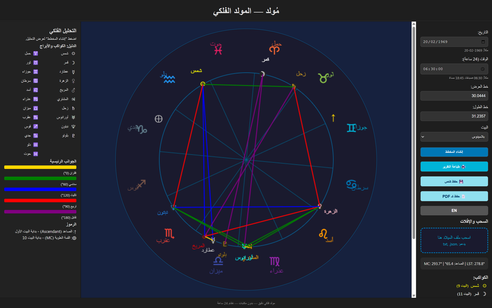

# 🌌 مُولد — التطبيق الفلكي الدقيق

  
    
  <strong>تطبيق ويب تفاعلي لرسم المخططات الفلكية بدقة — بدون مكتبات — قابل للتثبيت على الهاتف</strong>

---

## 📖 نظرة عامة

**مُولد** هو تطبيق ويب فلكي دقيق مبني بجافا سكريبت خالص، يُمكنك من:

- ✅ رسم مخطط فلكي (هوروسكوب) دقيق
- ✅ حساب الصاعد (Ascendant) والقمة العلوية (MC)
- ✅ عرض الكواكب، الأبراج، والجوانب
- ✅ تحليل فلكي تفاعلي
- ✅ **التثبيت على الهاتف كتطبيق أصلي (PWA)**
- ✅ العمل بدون اتصال بالإنترنت

لا يعتمد على أي مكتبات خارجية — فقط HTML، CSS، وJavaScript.

🔗 **الرابط المباشر**: [https://h-phsoft.github.io/horoscope](https://h-phsoft.github.io/horoscope)

---

## 🎯 الميزات الرئيسية

| الميزة | الوصف |
|-------|-------|
| 🌍 **حسابات فلكية دقيقة** | يحسب اليوم الجولياني، LST، Ascendant، MC، ومواقع الكواكب |
| 🎨 **رسم تفاعلي** | دائرة فلكية كاملة مع 12 بيتًا، أسماء الكواكب، ورموز الأبراج |
| 🔍 **تلميحات ذكية** | عند المرور فوق البيت، يُظهر رقم البيت، البرج، والدرجات |
| 📱 **قابل للتثبيت (PWA)** | يمكن تثبيته على الهاتف كتطبيق أصلي |
| 🌐 **يدعم العربية والإنجليزية** | مع زر تبديل اللغة |
| 🖱️ **سحب وإفلات** | استيراد بيانات الميلاد من ملفات `.txt` أو `.json` |
| 🖨️ **طباعة وحفظ** | طباعة التقرير أو حفظه كـ نص أو PDF |
| 🔒 **يعمل بدون اتصال** | بعد أول تحميل، يعمل حتى بدون إنترنت |
| 🧩 **بدون تبعيات** | لا يستخدم jQuery، D3.js، أو أي مكتبات خارجية |

---

## 🚀 كيفية الاستخدام

1. افتح التطبيق من: [https://h-phsoft.github.io/horoscope](https://h-phsoft.github.io/horoscope)
2. أدخل تاريخ ووقت الميلاد (تم تعبئة 20 شباط 1969 تلقائيًا)
3. اضغط "إنشاء المخطط"
4. استخدم "تثبيت التطبيق" من المتصفح لتثبيته على الشاشة الرئيسية

---

## 📲 التثبيت على الهاتف (PWA)

### على أندرويد:
1. افتح الرابط في Chrome
2. اضغط على ⋮ → "تثبيت التطبيق"
3. تم! سيظهر كتطبيق أصلي

### على آيفون:
1. افتح في Safari
2. اضغط على أيقونة المشاركة → "إضافة إلى الشاشة الرئيسية"

---

## 🛠️ التطوير بواسطة
- 💻 **المطور**: h-phsoft
- 🌐 [GitHub](https://github.com/h-phsoft)

---

## 📜 الترخيص / License

هذا المشروع مرخص تحت رخصة **MIT** — مفتوح المصدر للاستخدام الشخصي والتجاري.  
✅ يمكنك: الاستخدام، التعديل، التوزيع — حتى تجاريًا — مع الإبقاء على حقوق الملكية.

This project is licensed under the **MIT License** — free to use, modify, and distribute — even commercially — as long as you preserve the copyright notice.

📄 [عرض نص الرخصة الكاملة](LICENSE)

---

## 🤝 المساهمة / Contributing

نرحب بالمساهمات! ❤️  
سواء كنت مطورًا، مصممًا، أو محررًا — مشاركتك تهمنا.

### كيف تساهم؟

1. 🐛 **أبلغ عن خطأ**: افتح [Issue جديد](https://github.com/h-phsoft/horoscope/issues/new?template=bug_report.md)  
2. 💡 **اقتراح ميزة**: افتح [Issue جديد](https://github.com/h-phsoft/horoscope/issues/new?template=feature_request.md)  

---

## 📬 التواصل / Contact

لأي استفسار أو اقتراح — نحن هنا لمساعدتك:

📧 **البريد الإلكتروني**: [h.phsoft@gmail.com](mailto:h.phsoft@gmail.com)  
🐙 **GitHub**: [@h-phsoft](https://github.com/h-phsoft)  
🌍 **المشروع الحي**: [h-phsoft.github.io/horoscope](https://h-phsoft.github.io/horoscope/)

---

## 📜 سياسة الاستخدام / Usage Policy

هذا المشروع مخصص **للأغراض التعليمية، البحثية، والبرمجية فقط**.  
❌ **ممنوع تمامًا** استخدامه لأي غرض:

- مخالف للقوانين المحلية أو الدولية.
- يُشجع على الكراهية، التمييز، أو ازدراء الأديان.
- تجاري دون إذن مسبق من المؤلف.
- ضار أو مسيء بأي شكل.

استخدامك لهذا المشروع يعني موافقتك على هذه الشروط.

---

This project is intended **for educational, research, and programming purposes only**.  
❌ **Strictly prohibited** to use it for any purpose that:

- Violates local or international laws.
- Promotes hate, discrimination, or religious disrespect.
- Commercial use without prior written permission.
- Harmful or abusive in any form.

Your use of this project implies acceptance of these terms.
